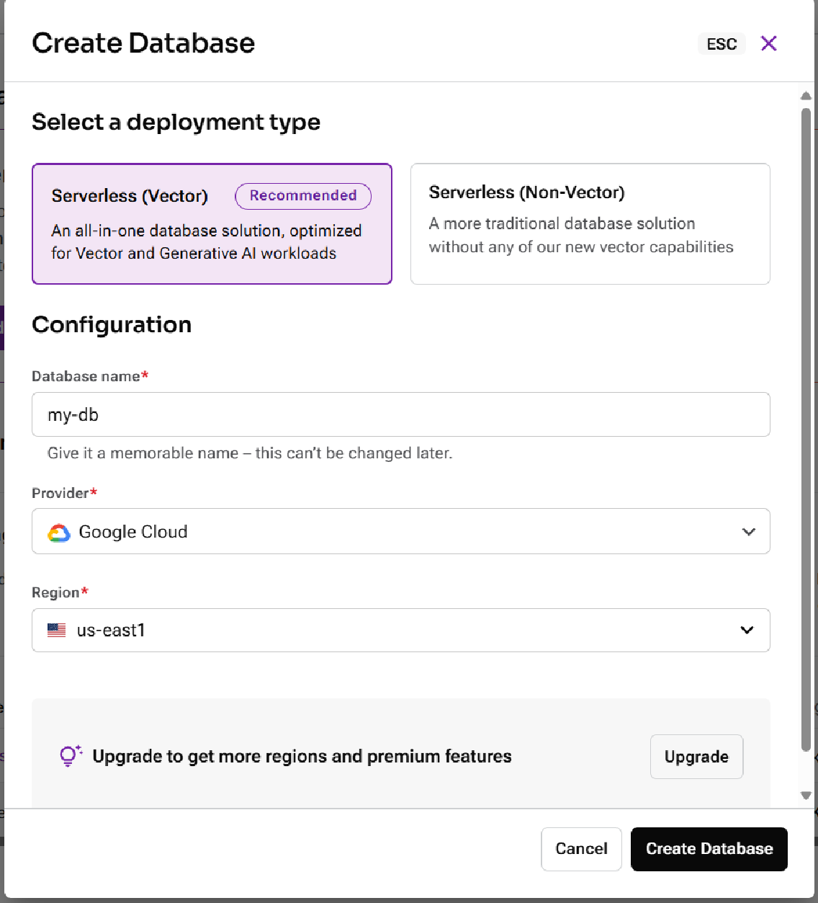
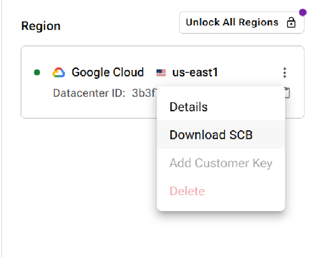
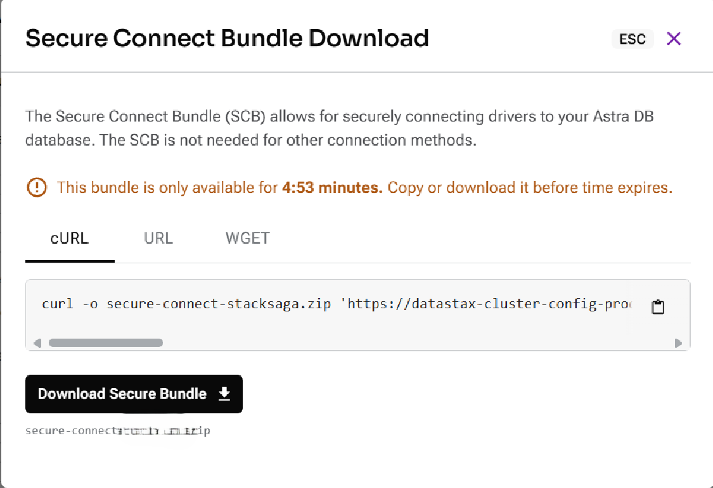
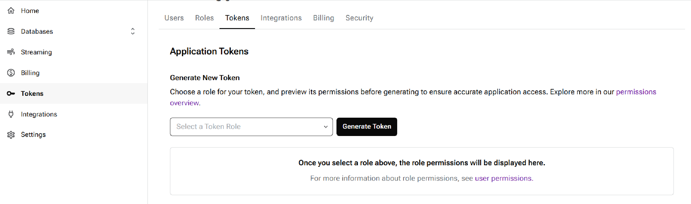
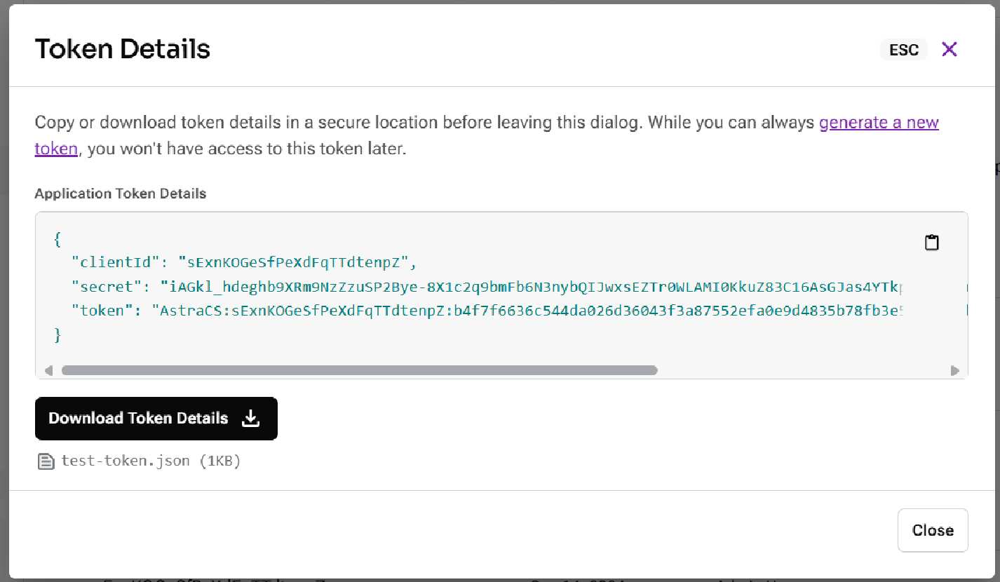

= how to configure and use https://astra.datastax.com/[astra-datastax cloud cassandra database] with spring boot with spring-boot-starter-data-cassandra.

Steps

. Login or create your account on [https://accounts.datastax.com/session-service/v1/login](datastax cloud)

. Create the Database
+

. Download the zip file (SCB)
+

For demonstration purpose, the file is downloaded to the `resources` folder.
+

+

. Generate a token with necessary permissions and copy the `clientId` and `secret` for adding to the properties file. The client-id acts as the `username` and the secret acts as the `password`.
+

+

. Configure the xref:src/main/resources/application.yaml[application.yaml] file with collected data.

+

[source]
----
include::src/main/resources/application.yaml[source,yaml]
----

. Run the application and test the session by invoking the `test` endpoint.

[source,shell]
----
curl --location 'http://localhost:8080/test'
----